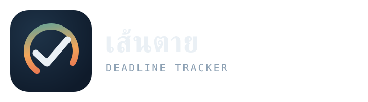

# เส้นตาย — Deadline To-Do (Web Push + Google Sheets + GitHub)



เว็บแอป To-Do List ที่เก็บข้อมูลใน Google Sheets, โฮสต์ฟรีบน GitHub Pages,
และแจ้งเตือนแบบ Web Push อัตโนมัติ 1 วันก่อนถึงกำหนด ผ่าน GitHub Actions cron job
พร้อมติ๊กว่า "ทำแล้ว" ได้จากตัวแจ้งเตือนโดยตรง ไม่ต้องเปิดแอป

## เรื่องวิดเจ็ตบนหน้าจอโฮม — สิ่งที่ทำได้จริงตอนนี้

ขอพูดตรงๆ ก่อนว่า **เว็บแอป (PWA) ยังสร้างวิดเจ็ตแบบเนทีฟบนหน้าจอโฮมของ iOS/Android
ไม่ได้จริง ๆ ในตอนนี้** — นี่คือข้อจำกัดของแพลตฟอร์มเอง ไม่ใช่ของโค้ดนี้
(แม้แต่ Google เองก็ยืนยันว่า PWA ยังทำ home screen widget ทั้งบน iOS และ Android ไม่ได้)
ถ้าต้องการวิดเจ็ตแบบ Android home screen จริง ๆ ต้องพัฒนาแอปเนทีฟแยกต่างหาก (เช่นใช้ Kotlin
+ Glance API) ซึ่งเป็นโปรเจกต์คนละขนาดจากเว็บแอปนี้ — บอกได้ถ้าอยากให้ช่วยวางแผนต่อ

สิ่งที่ทำได้จริงและใส่ไว้ให้แล้วในโปรเจกต์นี้ ซึ่งใกล้เคียงกับ "วิดเจ็ตติ๊กงาน" มากที่สุด:

- **ติ๊ก "ทำแล้ว" ได้จากตัวแจ้งเตือนเลย** — เมื่อ push notification เด้งขึ้นมา จะมีปุ่ม
  "✓ ทำแล้ว" ให้กดได้ทันที ไม่ต้องเปิดแอป ระบบจะอัปเดต Google Sheets ให้อัตโนมัติ
  (ทำงานผ่าน Service Worker ดูโค้ดที่ `src/sw-template.js`)
- **เพิ่มไอคอนแอปที่หน้าจอโฮมได้** (Add to Home Screen) ทำให้เปิดแอปได้เร็วเหมือนแอปจริง
  พร้อมไอคอนที่ออกแบบมาให้ — เปิดปุ๊บเจอรายการที่ต้องติ๊กทันที


## โครงสร้างโปรเจกต์

```
todo-webapp/
├── src/                        # React app (หน้าเว็บ)
│   └── sw-template.js           # ต้นฉบับ Service Worker (แก้ที่นี่ ไม่ใช่ public/sw.js)
├── public/                     # ไฟล์ static — ไอคอน, manifest, sw.js (สร้างอัตโนมัติ)
├── brand/                       # โลโก้ + ไอคอนต้นฉบับความละเอียดสูง
├── apps-script/Code.gs           # Backend API (วางใน Google Sheets > Apps Script)
├── scripts/
│   ├── check-and-notify.js       # เช็คเดดไลน์ + ส่ง push (รันโดย GitHub Actions)
│   └── inject-sw-config.js       # ฝัง SHEET_API_URL ลงใน sw.js ตอน build
└── .github/workflows/
    ├── deploy.yml                # build + deploy ขึ้น GitHub Pages ทุกครั้งที่ push
    └── notify.yml                # cron รันทุกวัน เช็คงานที่ใกล้ครบกำหนด
```

## ขั้นตอนติดตั้ง (ทำตามลำดับ)

### 1. สร้าง Google Sheet + Apps Script backend

1. สร้าง Google Sheet ใหม่ ตั้งชื่อ 2 แท็บ: `Tasks` และ `Subscriptions`
2. ใส่หัวตารางแถวแรก:
   - แท็บ `Tasks`: `id | title | date | time | status | notified`
   - แท็บ `Subscriptions`: `id | endpoint | p256dh | auth`
3. เมนู **Extensions > Apps Script** วางโค้ดจาก `apps-script/Code.gs` ทับของเดิม
4. **Deploy > New deployment** เลือกประเภท **Web app**
   - Execute as: **Me**
   - Who has access: **Anyone**
5. คัดลอก URL ที่ได้ (ลงท้ายด้วย `/exec`) เก็บไว้ — นี่คือ `SHEET_API_URL`

### 2. สร้าง VAPID keys (กุญแจสำหรับ Web Push)

รันคำสั่งนี้บนเครื่อง (ต้องมี Node.js):

```bash
npx web-push generate-vapid-keys
```

จะได้ Public Key และ Private Key เก็บไว้ทั้งคู่

### 3. Push โค้ดขึ้น GitHub

1. สร้าง repo ใหม่บน GitHub เช่นชื่อ `deadline-todo`
2. แก้ `vite.config.js` — เปลี่ยน `base: '/deadline-todo/'` ให้ตรงกับชื่อ repo จริงของคุณ
3. Push โค้ดทั้งหมดในโฟลเดอร์นี้ขึ้น repo

### 4. ตั้งค่า GitHub Secrets

ไปที่ repo **Settings > Secrets and variables > Actions** เพิ่ม secrets ต่อไปนี้:

| ชื่อ | ค่า |
|---|---|
| `SHEET_API_URL` | URL จากขั้นตอนที่ 1 |
| `VAPID_PUBLIC_KEY` | public key จากขั้นตอนที่ 2 |
| `VAPID_PRIVATE_KEY` | private key จากขั้นตอนที่ 2 |

### 5. เปิดใช้ GitHub Pages

ไปที่ repo **Settings > Pages** > Source เลือก **GitHub Actions**

### 6. Deploy

Push ขึ้น branch `main` — workflow `deploy.yml` จะ build และขึ้นเว็บให้อัตโนมัติ
เว็บจะอยู่ที่ `https://<username>.github.io/deadline-todo/`

### 7. ทดสอบระบบแจ้งเตือน

- เข้าเว็บ กดปุ่ม "เปิดการแจ้งเตือน" (ต้องอนุญาต browser permission)
- เพิ่มกิจกรรมที่มีวันที่ = พรุ่งนี้
- ไปที่ repo **Actions > Check deadlines and notify > Run workflow** เพื่อรันด้วยมือทันที (ไม่ต้องรอ cron ทุกเช้า)
- ถ้าตั้งค่าถูกต้อง จะได้รับ push notification เด้งขึ้นมา

## รันทดสอบบนเครื่องตัวเอง (local dev)

```bash
npm install
cp .env.example .env   # แล้วใส่ค่า SHEET_API_URL และ VAPID_PUBLIC_KEY ของคุณ
npm run dev
```

## ข้อควรรู้

- **iPhone/iOS**: ต้องกด "แชร์ > เพิ่มไปยังหน้าจอโฮม" ก่อน ถึงจะรับ push ได้ (ข้อจำกัดจาก Apple ตั้งแต่ iOS 16.4+) เปิดผ่าน Safari เฉยๆ จะไม่ได้รับ
- **เวลา cron**: ตั้งไว้ 08:00 น. เวลาไทยทุกวัน แก้ได้ที่ `.github/workflows/notify.yml` (`cron: '0 1 * * *'` เป็นเวลา UTC)
- ไอคอนแอปและโลโก้อยู่ใน `public/` (ใช้งานจริงในเว็บ) และ `brand/` (ไฟล์ต้นฉบับความละเอียดสูง + โลโก้เต็มสำหรับ README/การตลาด)
- แจ้งเตือนจะส่งครั้งเดียวต่อรายการ (เมื่อ `notified` เปลี่ยนเป็น true จะไม่ส่งซ้ำ)
- ปุ่ม "✓ ทำแล้ว" บนการแจ้งเตือนใช้ได้เฉพาะตอนเปิดแอปผ่าน HTTPS/GitHub Pages เท่านั้น (ข้อกำหนดของ Push API)

## Brand assets

| ไฟล์ | ใช้ที่ไหน |
|---|---|
| `brand/icon-1024.png` | ไอคอนต้นฉบับความละเอียดสูงสุด สำหรับตัดต่อ/ทำ store listing ในอนาคต |
| `brand/logo-wordmark.svg` | โลโก้เต็ม (ไอคอน + ชื่อ) ใช้ใน README, เว็บไซต์การตลาด, เอกสาร |
| `public/icon-192.png`, `public/icon-512.png` | ไอคอนแอปตอนเพิ่มลงหน้าจอโฮม |
| `public/icon-maskable-512.png` | ไอคอนแบบ "maskable" ที่ Android ครอบรูปทรงได้โดยไม่ตัดขอบเพี้ยน |
| `public/favicon.ico`, `favicon-32.png` | ไอคอนแท็บเบราว์เซอร์ |
| `public/apple-touch-icon.png` | ไอคอนตอนเพิ่มไปหน้าจอโฮมบน iOS |
